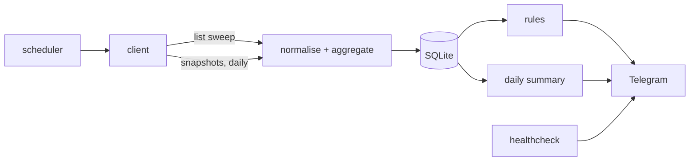

# shine-felicity: architecture

Fleet monitoring and reporting for Translight's Felicity Solar installations, modelled on the existing FusionSolar notification system.

Last updated: 2026-10-06. Status: exploration. Only `probe.py` exists; everything under "Target design" is proposed and not yet built.

## 1. Purpose and scope

The system polls the Felicity cloud for every plant visible to the Translight portal account, keeps a small history, sends Telegram alerts when a plant needs attention, and produces a daily summary. It is read-only. Changing inverter settings is out of scope, and the client must make that impossible rather than merely unused (see section 8).

## 2. Constraints

The design follows from four facts established during exploration.

The account has no OpenAPI privilege. Calls to the documented `/openApi/...` endpoints return `2001528 Insufficient permissions`. Until Felicity enables that, the system uses the same internal endpoints the web portal uses. These are undocumented and can change without notice, so every response is parsed defensively and a schema change must degrade to an alert, not a crash.

The fleet is large. The account sees 518 devices: inverters, battery packs, and sub-entries whose serial number ends in `-1` or `-2`. A snapshot call per device, spaced one second apart, takes more than ten minutes per sweep. Per-device polling is therefore reserved for the few things only a snapshot can provide.

Rate limits are unknown. Nothing is published, so the poller stays slow, backs off on errors, and never runs sweeps concurrently.

The account can write. Its permission tags include device setting rights, so a bug or a careless addition could alter a customer's inverter. The client is restricted to an allowlist of read endpoints.

## 3. Data source

Host: `https://shine-api.felicitysolar.com`. Errors are returned as HTTP 200 with a body-level `code`, so the client branches on the body, never the HTTP status alone.

| Purpose | Call | Used for |
|---|---|---|
| Login | `POST /userlogin` | Token, sent as-is in the `authorization` header |
| Device list | `POST /device/list_device_all_type` | Fleet sweep: plant, status, live power and SOC |
| Snapshot | `POST /device/get_device_snapshot` | Per-device detail: daily energy, work mode, warnings |
| OpenAPI data | `/openApi/data/...` | Blocked (2001528). Preferred source if access is granted |

Login encrypts the password with RSA PKCS#1 v1.5 against a public key embedded in the portal's JavaScript bundle. The client scrapes that key and falls back to the key published in the OpenAPI document. The token is a JWT prefixed with `Bearer_`; its `exp` claim is read without verification to schedule re-login, and codes 998 and 999 trigger an immediate re-login and one retry. The token is cached on disk with mode 0600.

## 4. Data model

A device-list row carries everything needed for a plant-level view, which is why the list is the primary source.

| Field | Meaning | Notes |
|---|---|---|
| `plantId`, `plantName` | Plant membership | Grouping key is `plantId` |
| `deviceSn`, `deviceModel`, `type`, `deviceType` | Identity | `deviceType` codes are undocumented; `OG` seen on an IVEM inverter |
| `status` | Connection state | Codes undocumented; `OL` seen on a device with no live data |
| `ratedPower` | Nameplate | kW for inverters (`8` for an IVEM8048) |
| `pvTotalPower` + `pvTotalPowerUnit` | PV power | Unit is `W` or `kW` and must be applied |
| `bmsPower` + `bmsPowerUnit`, `battSoc` | Battery | Present on both inverter and pack rows |
| `totalPower` + `totalPowerUnit` | Unconfirmed | Load or inverter output; to be verified |
| `ctAcTtlInPower` + unit | Grid power at CT | Sign convention to be verified |
| `wkStateName`, `failCode` | Work mode, fault | |
| `parentId`, `invDeviceSn` | Device hierarchy | Likely links packs and sub-entries to an inverter |

Normalisation rules. All power values are converted to watts using the row's unit field; snapshots showed IVGM models reporting in kW while IVEM and T-REX report in W, so no value is trusted without its unit. Numeric fields arrive as strings or null and are parsed as optional floats.

Aggregation rules per plant. PV, load and grid power are summed over inverter rows only. Battery power is summed over inverter rows, falling back to pack rows when no inverter reports it, because the inverter sees the whole bank while pack rows cover only monitored packs; parallel inverters each report their own share, so summing inverters is correct. State of charge is taken from pack rows, falling back to inverter rows, because an inverter without a BMS link reports 0 %. Both average and minimum SOC are kept; the minimum drives alerts.

## 5. Target design

The layout mirrors the FusionSolar project so the two can be operated the same way.

| Module | Responsibility | State |
|---|---|---|
| `probe.py` | Exploration CLI: device sweep, `--plants`, `--watch` (watchlist report, optional Telegram), `--raw`, `--discover` | Exists |
| `felicity/client.py` | Auth, token cache, retries, endpoint allowlist, list and snapshot calls | Planned (extract from `probe.py`) |
| `felicity/model.py` | Row parsing, unit conversion, device classification | Planned |
| `felicity/plants.py` | Grouping and the aggregation rules in section 4 | Planned (logic exists in `probe.py`) |
| `felicity/store.py` | SQLite access | Planned |
| `felicity/rules.py` | Alert evaluation and debounce | Planned |
| `felicity/telegram_notify.py` | Message formatting and delivery | Planned |
| `felicity/daily_summary.py` | End-of-day report | Planned |
| `felicity/scheduler.py` | APScheduler jobs | Planned |
| `felicity/healthcheck.py` | Self-monitoring and watchdog alert | Planned |

Storage is a single SQLite file with four tables: `plant_state` (latest aggregate and consecutive-condition counters per plant), `samples` (one row per plant per sweep), `daily_energy` (one row per inverter per day), and `alerts` (open and closed alerts, which is what makes debounce and "resolved" messages possible). SQLite is sufficient at this write rate and keeps the Pi deployment to one process and one file.

## 6. Polling strategy

Three tiers keep the request count low.

The fleet sweep pages through the device list at 50 rows per page: 11 calls for 518 devices, about 15 seconds with a one-second gap. Proposed interval is 10 minutes, which is 66 calls an hour. This feeds status, power, SOC and fault alerts.

The detail tier calls the snapshot endpoint only where the list is insufficient: once per inverter after sunset to record daily PV energy (`ePvToday` and its variants), and on demand for a plant that has just raised an alert, to attach work mode and warning text. Battery packs and sub-entries are skipped. Calls are spaced two seconds apart and the daily job is allowed to take as long as it needs.

The watchlist tier covers high-profile plants that need periodic updates regardless of alerts. `watchlist.txt` names them by `plantId` or plant name. Each run does one list sweep to resolve membership, status and units, then takes a snapshot of every device in the watched plants only, skipping `-N` sub-entries, and sends one Telegram report with PV, load, grid input, battery power, SOC, PV today, work mode and warnings per plant. Snapshots carry no unit field, so each device's values are scaled by the unit its device-list row declares; this assumes the two endpoints use the same unit per device and should be checked against the portal for one IVGM plant. This tier exists today as `probe.py --watch watchlist.txt --telegram`, run from cron.

If the list turns out not to carry live values for online devices (open question 1), the sweep falls back to snapshots for inverters only, grouped by plant, and the interval lengthens to match.

## 7. Alerts and reporting

Proposed rules, all evaluated per plant on the aggregate and all subject to debounce. Thresholds are starting points to tune against real data.

| Rule | Condition | Debounce |
|---|---|---|
| Offline | No device in the plant reports live values | 3 consecutive sweeps |
| Fault | Any `failCode` present | Immediate, once per code |
| Low battery | Minimum SOC below 20 % | 2 consecutive sweeps |
| No PV in daylight | PV is zero between 09:00 and 15:00 while online | 3 consecutive sweeps |
| Recovered | An open alert's condition clears | 2 consecutive sweeps |

Each alert is sent once when it opens and once when it closes. With several hundred plants, an unbounced per-sweep notification would make the channel unusable, so repeat suppression is a requirement, not a refinement.

The daily summary lists fleet PV energy for the day, plants offline or in fault, plants that hit low SOC, and the lowest-yield plants relative to rated power. Specific yield uses inverter `ratedPower` as a proxy until array kWp per plant is recorded, which the API does not provide.

## 8. Failure handling and security

Network errors (timeouts, connection resets, DNS failures) are retried three times with exponential backoff. A sweep that still fails is recorded and skipped; it must not be reported as every plant going offline. The healthcheck raises a single Telegram alert after a set number of consecutive failed sweeps, and another on recovery.

Login failures are distinguished by code: 1002006 (wrong password, or a changed RSA key) and 1002001 (account not activated) stop the poller and alert, since retrying will not help. A response missing expected fields is logged with its keys and raises a "schema changed" alert.

TLS verification stays on. The servers are reported to omit their intermediate certificate; if that causes failures on the Pi, the fix is a CA bundle containing the intermediate (`FELICITY_CA_BUNDLE`), never `verify=False`, because the login request carries the account password.

Credentials live in an environment file readable only by the service user and are never committed. The client exposes only login, device list and snapshot; any other path raises before a request is made.

## 9. Deployment

Target is the existing Raspberry Pi (`tsl-server`) as a second systemd service alongside the FusionSolar one, with its own virtual environment, working directory and environment file. The scheduler runs in `Africa/Accra`. Development and exploration happen on the MacBook with `probe.py`.

## 10. Open questions

These are unverified and block or shape the build. Items 1 to 4 are answered by one run of `probe.py --plants`.

1. Does the device list carry live values for online devices? The only row inspected so far had every live field null.
2. What do the `status` codes mean? `OL` is assumed to be offline.
3. What are the `deviceType` codes, and is `BP` the battery-pack code the aggregation assumes?
4. Is `totalPower` load or inverter output?
5. What is the sign convention of `ctAcTtlInPower` and `bmsPower`? Snapshots suggest positive battery power is charging; the OpenAPI document says negative grid power is export.
6. What are the `-1` and `-2` sub-entries, and should they be excluded from counts?
7. When does the "today" energy counter reset? The list row showed a null `timeZone`, so a device with a wrong clock would misplace its daily total.
8. What page size does the device list accept? 50 works; a larger page would cut the sweep further.
9. How long does the portal token last?
10. Will Felicity grant OpenAPI access? If so, `client.py` gains a second backend and the rest of the system is unchanged.

## 11. Build order

1. Resolve open questions 1 to 6 with `probe.py`.
2. Extract `client.py`, `model.py` and `plants.py` from `probe.py`, with tests built from captured responses.
3. Add `store.py` and the fleet sweep job; run it for several days without alerts to collect data.
4. Tune thresholds against that data, then enable `rules.py` and Telegram delivery.
5. Add the daily energy job and daily summary.
6. Deploy to the Pi with the healthcheck.
