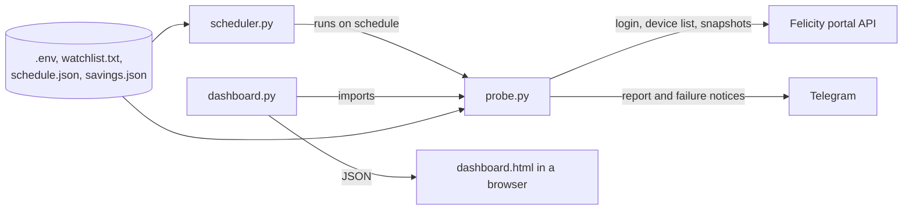

# Shine-Felicity automations: architecture

Monitoring and reporting for Translight's Felicity Solar installations, modelled on the existing FusionSolar notification system.

Last updated: 2026-10-09. Status: the scheduled Telegram reports run as a systemd service on the Raspberry Pi (`tsl-server`). The live dashboard, battery energy figures and savings are built and tested against mocked data and samples of real responses; they have had limited use against the live portal. Fleet-wide alerting, stored history and client access are not built (section 11).

## 1. Purpose and scope

The system reads a chosen set of plants (the watchlist) from the Felicity cloud and presents them in two ways: a Telegram report sent on a weekday and weekend schedule, and a web dashboard showing an energy-flow panel per plant. For each plant it reports solar, load, grid and battery power, state of charge, battery energy stored and rated, estimated backup time, solar energy today and money saved.

It is read-only. Nothing in the code changes an inverter setting. It does not yet watch the whole fleet, raise alerts on its own, or keep history.

## 2. Constraints

The design follows from six facts established against the live system.

The account has no OpenAPI privilege. Felicity's documented `/openApi/...` endpoints return `2001528 Insufficient permissions` for an ordinary portal account, so the system uses the internal endpoints the web portal itself calls. These are undocumented and can change without notice.

The fleet is large. The account sees about 527 devices: inverters, battery packs, high-voltage battery stacks, and sub-entries whose serial number ends in `-1` or `-2`. A snapshot call per device, spaced one second apart, takes around ten minutes, which is why everything is built around a short watchlist.

Rate limits are unknown. Neither the OpenAPI document nor the portal publishes one, so calls are spaced a second apart, never run concurrently, and the scheduler and dashboard both enforce minimum intervals.

The account can write. Its permission tags include device-setting rights, so the code must never call anything but the three read endpoints in section 3.

The portal keeps serving the last snapshot of a device that has stopped reporting. One plant returned a complete, plausible snapshot that was 66 days old. Offline devices therefore have to be detected and excluded, or stale values are shown as live.

Devices upload every five minutes (`reportFreq` 300 in the snapshot). Reading more often than that returns the same data.

## 3. Data source

Host: `https://shine-api.felicitysolar.com`. Errors are returned as HTTP 200 with a body-level `code`, so the client branches on the body, never on the HTTP status alone.

| Purpose | Call | Used for |
|---|---|---|
| Login | `POST /userlogin` | Token, sent as-is in the `authorization` header |
| Device list | `POST /device/list_device_all_type` | Plant membership, device status, power units, battery capacity field |
| Snapshot | `POST /device/get_device_snapshot` | All live values, energy counters, battery detail, last data time |
| OpenAPI | `/openApi/...` | Not used. Blocked for this account (2001528) |

Login encrypts the password with RSA PKCS#1 v1.5 against a public key embedded in the portal's JavaScript bundle. The client scrapes that key and falls back to the key published in the OpenAPI document, or uses `FELICITY_PUBKEY` if set. The token is a JWT prefixed with `Bearer_`; its `exp` claim is read without verification, the token is cached in `~/.felicity_token.json` with mode 0600, and body codes 998 and 999 trigger one re-login and retry.

The device list is paged at 50 rows, so a full sweep is 11 calls. Paging stops on the server's page count, on a page with no new serial numbers, or after 300 seconds.

There is no enforced endpoint allowlist yet: `FelicityPortal.post()` accepts any path. Only the three calls above appear in the code, but a guard that rejects any other path is a planned hardening (section 11).

## 4. Components

| File | Role |
|---|---|
| `probe.py` | Everything that touches Felicity and Telegram: login, device list, snapshots, per-plant aggregation, battery energy, savings, report formatting, Telegram delivery. Also the command-line tool |
| `scheduler.py` | Runs `probe.py --watch <watchlist> --telegram` at the times in `schedule.json`. Standard library only |
| `dashboard.py` | Web server and background poller. Imports `probe.py` for data and serves `dashboard.html` and `/api/state` |
| `dashboard.html` | The page: one energy-flow panel per plant, totals row, status and notices. No external assets |
| `watchlist.txt` | The plants to report, one per line, by `plantId` or name |
| `schedule.json` | Weekday and weekend start, end and interval for the Telegram reports |
| `savings.json` | Tariff per plant, or a default, used for the savings figures |
| `.env` | Credentials and optional settings. Never committed |
| `felicity-watch.service`, `felicity-dashboard.service` | systemd units for the Pi |

`probe.py` loads `.env` itself, so cron and systemd need no shell wrapper. `probe.py` is one large file by history rather than design; splitting it into a client, a model and a reporting module is on the roadmap.

## 5. Data model

Two sources are combined per device. The device-list row gives `plantId`, `plantName`, `deviceSn`, `deviceModel`, `status`, the unit of each power field (`pvTotalPowerUnit` and its siblings), and `battCapacity`. The snapshot gives every live value. Numeric fields arrive as strings or null and are parsed as optional floats.

Device classification. A device is a battery if the list row carries a `battCapacity`, if its `deviceType` is `BP`, or if the snapshot's `productTypeEnum` is `LITHIUM_BATTERY_PACK`. Inverter rows leave `battCapacity` null. Everything else is an inverter. Sub-entries (`<serial>-1`, `-2`) duplicate their parent's battery data and are skipped.

Units. Snapshots carry no unit, and models differ: IVGM hybrids report power in kW, IVEM and T-REX in W. Each device's snapshot powers are scaled by the unit its list row declares. This assumes the two endpoints use the same unit per device.

Status codes. `OL` is offline; this is confirmed by devices whose last data was days or weeks old. `NM` and `AL` are taken to mean normal and alarm; both return current data.

Offline detection. A device is offline if its status is `OL`, or if its snapshot is more than 12 hours old. The age test is only a backstop: the snapshot's numeric `dataTime` is 8 hours earlier than its text `dataTimeStr`, which matches local time, so age cannot be judged more finely than that. The text time is what is shown to users.

Sign conventions. Grid power (`acTtlInpower`) is positive when importing, per the OpenAPI document. Battery power is positive when charging; this is inferred from live data, not documented.

Snapshot fields in use:

| Quantity | Fields, in order of preference |
|---|---|
| Solar power | `pvTotalPower`, `pvPower` |
| Grid power | `acTtlInpower` |
| Load power | `totalConsumPower`, `acTotalOutActPower` |
| Battery power | `emsPower`, `bmsPower` |
| State of charge | `emsSoc`, `battSoc` |
| Work mode | `workModeStr`, `operMStr` |
| Solar energy | `ePvToday`, `ePvMonth`, `ePvYear`, `ePvTotal` and lowercase variants |
| Exported energy | `eGridFeedToday`, `eGridFeedMonth`, `eGridFeedYear`, `eGridFeedTotal` |
| Battery energy | `ratedEnergy`, `capacity`, `volt`, `battVolt`, `batCount`, `cellNumber`, `bmsVoltageList`, `BMSLCVolt`, `BMSLDVolt` |
| Last data | `dataTimeStr`, `dataTime`, `status` |

## 6. Per-plant calculations

Offline devices and devices that return an error are excluded from every figure below and listed separately. A plant with no reporting device is marked offline with the time of its last data.

Power. Solar, load and grid power are summed over inverters. Battery power is summed over inverters, falling back to battery devices when no inverter reports it, because an inverter sees the whole bank while battery rows cover only monitored packs. Parallel inverters each report their own share, so summing is correct.

State of charge is taken from battery devices, falling back to inverters. An inverter with no battery data link reports 0 %, so a plant with no battery devices whose inverters all read 0 % is shown as unknown. Both the average and the minimum are kept; the minimum drives the low-battery flag.

Battery energy. Felicity's `ratedEnergy` is per module. A 48 V pack is one module (an FLA48500 reports 25 kWh). A high-voltage FLH stack is several 5.12 kWh modules in series, so its rated energy is `ratedEnergy` times the module count: 51.2 kWh for ten modules, 61.44 kWh for twelve. If `ratedEnergy` is absent, capacity in Ah times nominal voltage is used, then the Ah embedded in the model name.

Module count is established in this order. The count the stack reports (`batCount`, `cellNumber`, or the number of module voltages listed) is used when it agrees with stack voltage divided by module voltage to within 25 %. Some stacks report a count of zero; those take the count of a sister stack in the same plant whose voltage is within 5 %, since stacks in parallel on one DC bus must have the same series count. Failing that, the midpoint of the BMS charge and discharge voltage limits divided by the nominal module voltage is used, and last the stack voltage divided by 53.5 V, which can be off by one module and is flagged.

Stored energy is rated energy times present state of charge. The portal's `remainingBatteryEnergy` is not used; it is often missing or stale.

Backup time is the energy above a reserve level divided by the present load: (stored − rated × reserve) ÷ load. The reserve defaults to 20 % (`BATTERY_RESERVE_PCT`). It assumes solar and grid stop now and load stays constant, and ignores inverter losses and state of health.

Savings are solar energy used on site times the tariff in `savings.json`, plus exported energy times an export rate if one is set. Solar used on site is generation minus export, taken from the inverters' own today, month, year and lifetime counters, so no stored history is needed. Energy lost in the battery round trip is ignored, which makes the figure slightly optimistic.

## 7. Scheduling and polling

Telegram reports. `scheduler.py` computes run times from `schedule.json`: start, start plus interval, and so on up to and including end, separately for Monday to Friday and for Saturday and Sunday, in the configured timezone. It re-reads the file every 30 seconds, so edits apply without a restart, and keeps the previous schedule if the file is invalid. Each run is a child process, so a crash or hang in one run cannot stop the scheduler; a run that exceeds 15 minutes is killed and reported. A slot more than five minutes late is skipped, not sent late. The minimum interval is ten minutes.

Dashboard. `dashboard.py` polls Felicity only while the page is open in a visible browser tab, and goes idle two minutes after the last request. Each cycle takes one snapshot per device in the watched plants. The device list, which gives plant membership, is re-read every 30 minutes, and an edit to `watchlist.txt` is picked up on the next cycle. The default cycle is 60 seconds with a minimum of 30; since devices upload every five minutes, 300 seconds loses little. The page itself asks the dashboard server for cached state every five seconds, which costs Felicity nothing.

Cost per Telegram run: 11 device-list calls plus one snapshot per device in the watched plants, spaced one second apart.

## 8. Failure handling and security

Network errors (timeouts, connection resets, DNS failures) are retried three times with backoff and logged. A device-list request rejected with a body-level error code stops the run with that code and message. A scheduled run that fails sends one Telegram notice with the reason, so reports never stop silently. Telegram errors never include the request URL, because it contains the bot token.

A device that returns no data is listed under the plant as "no data", and a battery in that state marks the plant's capacity as unknown, so totals are not understated without saying so.

TLS verification stays on. If Felicity's certificate chain fails to verify on some machine, the fix is a CA bundle (`FELICITY_CA_BUNDLE`), never disabling verification, because the login request carries the account password.

Credentials live in `.env`, readable only by the service user, and are not committed. The dashboard is plain HTTP, listens on all interfaces by default, and has no password unless `DASHBOARD_PASSWORD` is set. It is meant for the private Tailscale network, not the internet. It serves only the page, the state JSON and a health check, sets a restrictive content security policy, and writes plant names into the page as text, never as HTML.

## 9. Deployment

Development happens on a MacBook. Production is the Raspberry Pi `tsl-server`, user `translight-iot`, project in `~/Shine-Felicity_Automations` with its own virtual environment, alongside the FusionSolar service. Python 3.10 or newer is required; the Pi runs 3.13. Two systemd units run the scheduler and the dashboard, both restarting on failure and starting at boot. Setup steps are in `README.md`.

The Pi and any development machine share one portal account. Whether Felicity allows concurrent sessions is not known; each side simply logs in again if its token is rejected.

## 10. Known issues and open questions

Load is probably under-read on IVGM hybrid inverters. The power balance does not close on the IVGM50K plants: one showed 36.8 kW solar plus 3.4 kW grid against 16.9 kW load and 11.0 kW battery charging, leaving about 12 kW unaccounted for. A second load field is likely being missed. Backup time is overstated on those plants until this is fixed; savings are unaffected because they use generation.

The month, year and lifetime energy counters are unverified. Only the "today" counter has been seen in real data; the other field names come from a community integration.

The unit assumption (snapshot values follow the device-list unit) has not been checked against the portal for an IVGM plant.

The battery power sign convention is inferred, not documented.

The module count of a lone stack that reports no count rests on voltage and may be off by one.

Unknown: how long the portal token lasts, whether the device list accepts a page size above 50, whether two sessions can coexist, and when the "today" counter resets relative to local midnight.

Open with Felicity: an OpenAPI account. With it, `probe.py` would gain a second, documented backend and the rest of the system would not change.

## 11. Roadmap

Fix the load reading on hybrid inverters, which needs one raw inverter snapshot to identify the missing field.

Enforce the read-only endpoint allowlist in `FelicityPortal.post()`.

Stored history: a small SQLite database on the Pi recording each plant reading. This enables power and energy charts, a grid-outage log, uptime, and a monthly report per client.

Client-only view. The agreed approach is one secret link per client mapped to their plants in a config file, with filtering done on the server and internal detail (serial numbers, raw errors, diagnostics) removed. Client plants would be polled on a fixed five-minute schedule and served from a cache, so public visitors cannot drive load on the Felicity account. The page would be published through a tunnel (Tailscale Funnel, or a Cloudflare Tunnel on Translight's own domain), with the public side reading only the cache and never holding the Felicity credentials. Longer term, the Pi could push readings to a small hosted app so nothing public reaches the private network.

Fleet-wide alerting: a periodic device-list sweep with debounced rules (offline, fault, low battery, no solar in daylight) and one message when an alert opens and one when it closes.

Refactor `probe.py` into a client, a model and a reporting module, with tests built from captured responses.
